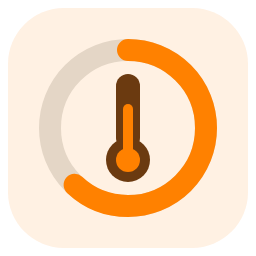
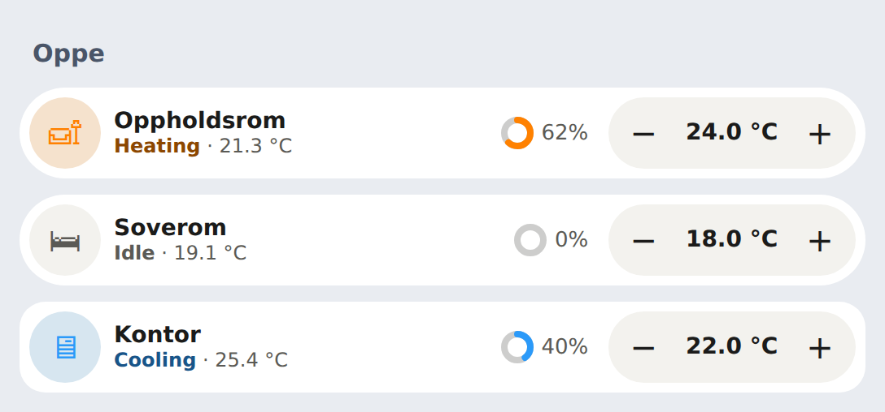

# Thermostat Valve Card

A compact Home Assistant dashboard card for one room thermostat: see whether the room is heating or cooling, how far the radiator valve is open, and nudge the target temperature with − and +. It works with any `climate` entity (Zigbee/Z-Wave TRVs, generic thermostats, heat pumps) and needs no companion integration.

It is a one-row card in the style of a Bubble Card climate button. It supports default and Bubble appearances, light and dark themes, the shared color schemes and a visual editor, in English and Norwegian Bokmål.



## Installation

Add `https://github.com/mvheimburg/lovelace-thermostat-valve` as a **Dashboard** custom repository in HACS, then install Thermostat Valve Card. HACS validation uses category `plugin`.

For manual installation, copy `dist/thermostat-valve-card.js` to `/config/www/thermostat-valve-card.js` and add `/local/thermostat-valve-card.js` as a JavaScript module resource under dashboard resources. Reload your browser.

```yaml
type: custom:thermostat-valve-card
entity: climate.oppholdsrom
icon: mdi:sofa
appearance: bubble
```

## Configuration

| Option         | Default                    | Meaning                                                                        |
| -------------- | -------------------------- | ------------------------------------------------------------------------------ |
| `entity`       | Required                   | The room's `climate` entity.                                                   |
| `valve_entity` | Found automatically        | A `sensor`, `number` or `input_number` reporting the valve opening in percent. |
| `show_valve`   | `true`                     | Set to `false` to hide the valve indicator.                                    |
| `name`         | The entity's friendly name | Row title. Your name is shown as written.                                      |
| `icon`         | The entity's icon          | Any `mdi:` icon, for example `mdi:sofa` or `mdi:bed`.                          |
| `appearance`   | `default`                  | `default` or `bubble` (follows Bubble Card theme variables).                   |
| `color_scheme` | `home-assistant`           | `home-assistant`, `bright`, `warm`, `mint`, `sky` or `lavender`.               |

The visual editor covers every option and suggests climate entities and percent sensors.

## What the row shows

- **Heating or cooling.** The icon, status word and valve ring turn warm while `hvac_action` is `heating` (also `preheating` and `defrosting`) and cool blue while it is `cooling`; the row itself keeps your card background. They stay neutral while idle or off. The status line shows the action and the current room temperature, for example _Heating · 21.3 °C_. A thermostat that does not report `hvac_action` is shown by its mode instead (_Heat_, _Cool_). Colors follow Home Assistant's `--state-climate-heat-color` and `--state-climate-cool-color`.
- **Valve opening.** A small ring and percentage. Without `valve_entity`, the card uses the first match from:
  1. the climate attributes `valve_position`, `valve_opening` or `pi_heating_demand`
  2. a percent `sensor` or `number` on the same device whose entity ID ends in `valve_opening`, `valve_position`, `valve`, `pi_heating_demand` or `heating_demand` (a valve reading is preferred over a heating-demand estimate)

  With no valve source the ring is hidden. When the valve comes from its own entity, tapping it opens that entity.

- **Target temperature.** − and + move the target by the thermostat's `target_temp_step`, within `min_temp` and `max_temp`. Presses are collected, and one `climate.set_temperature` call is sent 0.8 seconds after the last one. While it is on its way, the value is marked and the buttons pause, so no duplicate request is sent. If Home Assistant rejects it, the row shows why and goes back to the thermostat's own target.
- Tapping the icon or name opens Home Assistant's dialog for the thermostat. Use it to change HVAC mode or presets.

Thermostats that use a low/high range (`heat_cool` with `target_temp_low` and `target_temp_high`) show the range read-only; use the more-info dialog to change it. When the thermostat is unavailable or Home Assistant is disconnected, the buttons are disabled.

## Language and formats

Labels follow Home Assistant's language: Bokmål for `nb`, `nb-NO`, `no` and `nn` (Nynorsk falls back to Bokmål), English otherwise. Numbers follow your locale and Home Assistant's number-format setting, so an English interface with `en-GB` keeps British formats. Values sent to Home Assistant are always plain numbers. The card picker's name and description stay in English, because Home Assistant shows the picker before the card has a language context.

## Development

```sh
npm ci
npx playwright install chromium
npm test
npm run lint
npm run typecheck
npm run build   # writes dist/thermostat-valve-card.js, which is committed
npm run dev     # simulated preview at demo/
```

Releases are tagged from `package.json` when `main` changes.

## License

GPL-3.0. See [LICENSE](LICENSE).
