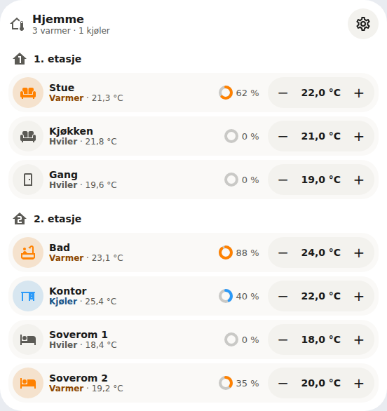
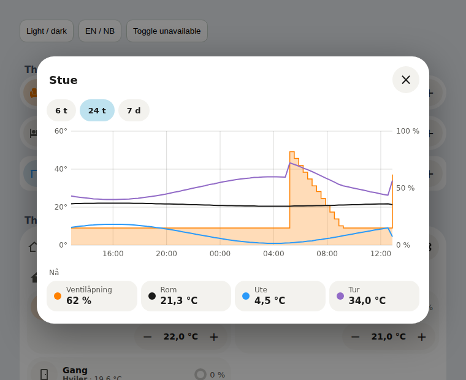

# Thermostat Valve Card

A compact Home Assistant dashboard card for one room thermostat: see whether the room is heating or cooling, how far the radiator valve is open, and nudge the target temperature with − and +. It works with any `climate` entity (Zigbee/Z-Wave TRVs, generic thermostats, heat pumps) and needs no companion integration.

It is a one-row card in the style of a Bubble Card climate button. The package also has a **Thermostat Group Card** that shows several rooms in one card, under optional headings such as floors (0.3.0). Both support default and Bubble appearances, light and dark themes, the shared color schemes and a visual editor, in English and Norwegian Bokmål.


## Installation

Add `https://github.com/mvheimburg/lovelace-thermostat-valve` as a **Dashboard** custom repository in HACS, then install Thermostat Valve Card. HACS validation uses category `plugin`.

For manual installation, copy `dist/thermostat-valve-card.js` to `/config/www/thermostat-valve-card.js` and add `/local/thermostat-valve-card.js` as a JavaScript module resource under dashboard resources. Reload your browser.

```yaml
type: custom:thermostat-valve-card
entity: climate.living_room
icon: mdi:sofa
appearance: bubble
outdoor_entity: sensor.outdoor_temperature
flow_entity: sensor.heat_pump_flow_temperature
```

## Configuration

| Option           | Default                    | Meaning                                                                        |
| ---------------- | -------------------------- | ------------------------------------------------------------------------------ |
| `entity`         | Required                   | The room's `climate` entity.                                                   |
| `valve_entity`   | Found automatically        | A `sensor`, `number` or `input_number` reporting the valve opening in percent. |
| `show_valve`     | `true`                     | Set to `false` to hide the valve indicator.                                    |
| `outdoor_entity` | None                       | Outdoor temperature sensor, drawn in the history.                              |
| `flow_entity`    | None                       | Flow (supply) temperature sensor, drawn in the history.                        |
| `name`           | The entity's friendly name | Row title. Your name is shown as written.                                      |
| `icon`           | The entity's icon          | Any `mdi:` icon, for example `mdi:sofa` or `mdi:bed`.                          |
| `appearance`     | `default`                  | `default` or `bubble` (follows Bubble Card theme variables).                   |
| `color_scheme`   | `home-assistant`           | `home-assistant`, `bright`, `warm`, `mint`, `sky` or `lavender`.               |

The visual editor covers every option and suggests climate entities and percent sensors.

## Thermostat Group Card



One card for a floor or the whole house. Each room is the same row as the single card, drawn as a tile, so the −/+ stepper, valve ring, history and failure messages work exactly as described below. The header shows what needs attention, for example _3 heating · 1 cooling_, and a Configure cog that explains where the settings live.

Add **Thermostat Group Card** in the dashboard editor and use its visual editor to add room groups and rooms, reorder or remove them, and give rooms a name, icon or valve entity. A new room stays in the editor until you choose its climate entity; a warning says the latest edits are not saved until then. Save the dashboard to keep changes; Cancel leaves the saved dashboard untouched.

The following IDs are examples; use your own climate entities.

```yaml
type: custom:thermostat-group-card
title: Upstairs
icon: mdi:home-floor-2
appearance: bubble
outdoor_entity: sensor.outdoor_temperature
flow_entity: sensor.heat_pump_flow_temperature
sections:
  - name: Bedrooms
    icon: mdi:bed
    thermostats:
      - entity: climate.bedroom_1
        name: Bedroom 1
        icon: mdi:bed
      - entity: climate.bedroom_2
  - thermostats: # a group without a heading
      - entity: climate.bathroom
        icon: mdi:bathtub-outline
        valve_entity: sensor.bathroom_valve_opening
```

| Option           | Default                            | Meaning                                                                            |
| ---------------- | ---------------------------------- | ---------------------------------------------------------------------------------- |
| `title`          | _Thermostats_ / _Termostater_      | Card title.                                                                        |
| `icon`           | `mdi:home-thermometer-outline`     | Header icon.                                                                       |
| `sections`       | None                               | Room groups, in order. Each has an optional `name` and `icon` and a `thermostats` list. |
| `thermostats`    | Required in a section              | Rooms: `entity` (a `climate` entity), and optional `name`, `icon` and `valve_entity`. |
| `outdoor_entity` | None                               | Outdoor temperature sensor, drawn in every room's history.                         |
| `flow_entity`    | None                               | Flow temperature sensor, drawn in every room's history.                            |
| `show_valve`     | `true`                             | Set to `false` to hide the valve indicator in every room.                          |
| `appearance`     | `default`                          | `default` or `bubble`.                                                             |
| `color_scheme`   | `home-assistant`                   | As for the single card.                                                            |

Rooms sit in one column in a narrow card and side by side in a wide one. The card grows with its rooms in a sections view. An invalid configuration is reported inside the card in Home Assistant's language.

## What the row shows

- **Heating or cooling.** The icon, status word and valve ring turn warm while `hvac_action` is `heating` (also `preheating` and `defrosting`) and cool blue while it is `cooling`; the row itself keeps your card background. They stay neutral while idle or off. The status line shows the action and the current room temperature, for example _Heating · 21.3 °C_. A thermostat that does not report `hvac_action` is shown by its mode instead (_Heat_, _Cool_). Colors follow Home Assistant's `--state-climate-heat-color` and `--state-climate-cool-color`.
- **Valve opening.** A small ring and percentage. Without `valve_entity`, the card uses the first match from:
  1. the climate attributes `valve_position`, `valve_opening` or `pi_heating_demand`
  2. a percent `sensor` or `number` on the same device whose entity ID ends in `valve_opening`, `valve_position`, `valve`, `pi_heating_demand` or `heating_demand` (a valve reading is preferred over a heating-demand estimate)

  With no valve source the ring is hidden.

- **Target temperature.** − and + move the target by the thermostat's `target_temp_step`, within `min_temp` and `max_temp`. Presses are collected, and one `climate.set_temperature` call is sent 0.8 seconds after the last one. While it is on its way, the value is marked and the buttons pause, so no duplicate request is sent. If Home Assistant rejects it, the row shows why and goes back to the thermostat's own target.
- Tapping the valve, the name or the temperature opens the room's **history** (below). Tapping the icon opens Home Assistant's dialog for the thermostat; use it to change HVAC mode or presets.

In a sections view the card grows to fit: on a narrow column the stepper moves under the name (before 0.3.0 the card claimed a fixed height, so the stepper could overlap the card below).

Thermostats that use a low/high range (`heat_cool` with `target_temp_low` and `target_temp_high`) show the range read-only; use the more-info dialog to change it. When the thermostat is unavailable or Home Assistant is disconnected, the buttons are disabled.

## History



One chart for the room over the last 6 hours, 24 hours (the default) or 7 days:

- the **valve opening** as a filled step area on the right-hand percent scale;
- the **room** temperature (the thermostat's `current_temperature`), and the **outdoor** and **flow** temperature when `outdoor_entity` and `flow_entity` are set, as lines on the left-hand temperature scale.

Move the pointer or a finger across the chart to read every value at that moment; otherwise the legend shows the current values. Tapping a legend entry opens that entity in Home Assistant. A spell where a sensor was unavailable is left as a gap. The data comes from Home Assistant's recorder, so an entity the recorder excludes has no history. The outdoor and flow sensors are set per card; use the same ones on every room card (0.2.0).

## Language and formats

Labels follow Home Assistant's language: Bokmål for `nb`, `nb-NO`, `no` and `nn` (Nynorsk falls back to Bokmål), English otherwise. Numbers follow your locale and Home Assistant's number-format setting, so an English interface with `en-GB` keeps British formats. Values sent to Home Assistant are always plain numbers. The card picker's names and descriptions stay in English, because Home Assistant shows the picker before the card has a language context.

## Development

```sh
npm ci
npx playwright install chromium
npm test
npm run lint
npm run typecheck
npm run build   # writes dist/thermostat-valve-card.js, which is committed
npm run dev     # simulated preview at demo/
node scripts/screenshot.cjs   # renders the images in docs/ from the simulated preview
```

The preview and README images use simulated states and generic room names only.

Releases are tagged from `package.json` when `main` changes.

## License

GPL-3.0. See [LICENSE](LICENSE).
